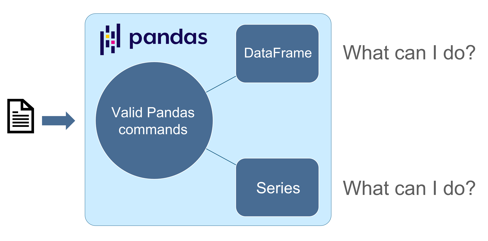

# Pandas Course

This course is aimed to give you enough knowledge to be confident to work with Pandas library.

## Useful Links

* Website:       https://pandas.pydata.org/ 
* Install Pandas:       https://pandas.pydata.org/pandas-docs/stable/getting_started/install.html
* Documentation: https://pandas.pydata.org/docs/
* User Guide: https://pandas.pydata.org/docs/user_guide/index.html#user-guide

## Pandas Data Structures

The most important data structures from Pandas library are `Series` and `DataFrame`. 

* Pandas Series: 1-Dimensional
* Pandas DataFrame: 2-Dimensional

It is a very good practice to ask yourself if the command you are about to type in Pandas will return a `Series` or `DataFrame` data structure. 
Each of them has its own methods and attributes and if you want to get confortable with Pandas, you need to learn what each of this data structure is able to do.

This is the reason why we will start learning `Series` or `DataFrame` data structure in the first two classes and then we will advance our study to more complex concepts. 
I cannot stress enough that you need to learn how to deal with `Series` and `DataFrame`. It is not important that you memorize their methods and attributes but having in mind what each data structure is able to do.

## Pandas Course: Notebooks

1. [Pandas Data Structure: Series](https://github.com/rscorrea1/youtube/blob/master/pandas_course/_notebooks/1_Pandas_Series.ipynb)
2. [Pandas Data Structure: DataFrame Get Started](https://github.com/rscorrea1/youtube/blob/master/pandas_course/_notebooks/2_Pandas_DataFrame_Basics.ipynb)
3. [Pandas Data Structure: DataFrame Selection] in development...