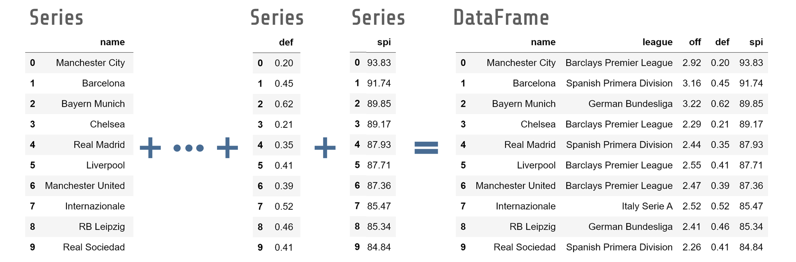

# Pandas Course

This course is aimed to give you enough knowledge to be confident to work with Pandas library.

## Useful Links

* Website:       https://pandas.pydata.org/ 
* Install Pandas:       https://pandas.pydata.org/pandas-docs/stable/getting_started/install.html
* Documentation: https://pandas.pydata.org/docs/
* User Guide: https://pandas.pydata.org/docs/user_guide/index.html#user-guide

## Pandas Data Structures

The most important data structures from Pandas library are `Series` and `DataFrame`. 
It is a very good practice to ask yourself if the command you are about to type in Pandas will return a `Series` or `DataFrame` data structure. 
Each of them has its own methods and attributes and if you want to get confortable with Pandas, you need to learn what each of this data structure is able to do.

* Pandas Series: 1-Dimensional
* Pandas DataFrame: 2-Dimensional

 

## Pandas Course: Notebooks

1. [Series Data Structure] (lhttps://github.com/rscorrea1/youtube/blob/master/pandas_course/_notebooks/0_Pandas_Data_Structures.ipynb)
2. [DaraFrame Data Structure] coming soon...